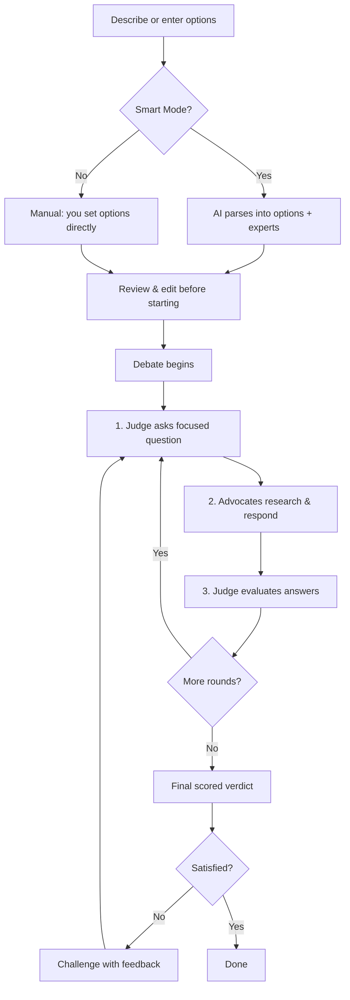
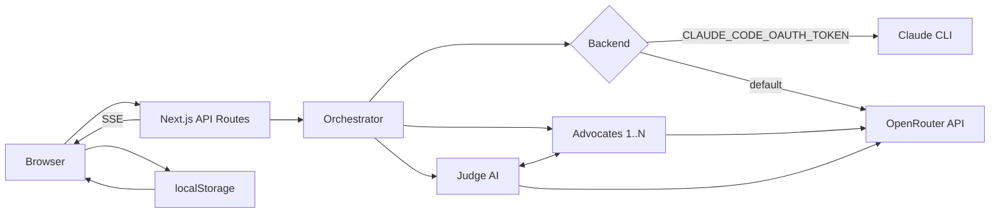

# ThinkTwice

**Stop guessing. Start debating.**

ThinkTwice is an AI-powered decision tool that doesn't just give you an answer — it stages a live debate between expert advocates arguing for each option, judged by a neutral AI evaluator. Watch the arguments unfold in real-time, then get a scored verdict.

## How It Works



## Features

- **Smart Mode** — Describe your decision in plain text. AI extracts options, assigns domain experts, and runs the debate
- **Manual Mode** — Input 2-4 options directly for quick debates
- **Live Streaming** — Watch advocates research and argue in real-time with streaming text
- **Multi-Round Debates** — Up to 8 rounds of structured argumentation with judge evaluations after each round
- **Scored Verdicts** — Final comparison scorecard rating each option across key criteria (0-10)
- **Challenge the Verdict** — Disagree? Challenge it with your reasoning and the debate continues
- **Mid-Debate Clarifications** — The judge can pause to ask you questions that sharpen the analysis
- **Auto-Pilot Mode** — Skip all clarification questions and let the debate run fully autonomously
- **Turkish & English UI** — Full i18n with one-click language toggle. Auto-detects browser language on first visit.
- **Dark & Light Theme** — Toggle between themes with a single button. Persists across sessions.
- **13+ Model Output Languages** — English, Turkish, German, French, Spanish, Italian, Portuguese, Dutch, Japanese, Korean, Chinese, Arabic, Russian, Hindi
- **Model Selection** — Choose from a curated list of debate-capable models fetched live from OpenRouter, plus a custom model input for any model.
- **Dual Backend** — Uses OpenRouter API (default). Set `CLAUDE_CODE_OAUTH_TOKEN` in `.env.local` to switch to the original Claude CLI backend.
- **Debate History** — All debates saved locally in your browser, replayable anytime

## Tech Stack

- **Framework:** Next.js 16 (App Router) + React 19
- **Styling:** Tailwind CSS 4
- **AI:** OpenRouter API (DeepSeek, Claude, GPT, Gemini — any model you choose)
- **Real-time:** Server-Sent Events (SSE)
- **Storage:** Browser localStorage (no database needed)

## Getting Started

### Prerequisites

1. **Node.js 20+**
2. **An OpenRouter account** (free to sign up at [openrouter.ai](https://openrouter.ai)) — add a small credit balance (DeepSeek models cost ~$0.02-0.15 per debate). Alternatively, if you have a Claude Pro/Max subscription and the `claude` CLI installed, set `CLAUDE_CODE_OAUTH_TOKEN` in `.env.local` instead.
3. **An OpenRouter API key** — generate one at [openrouter.ai/keys](https://openrouter.ai/keys)

### 1. Install & configure

```bash
git clone https://github.com/muctebadikmen/ThinkTwice.git
cd ThinkTwice
npm install
cp .env.local.example .env.local   # then paste your API key into .env.local
```

Your `.env.local` should look like:

```bash
OPENROUTER_API_KEY=sk-or-v1-…
```

`.env.local` is gitignored, so your key is never committed.

### 2. Run

```bash
npm run dev
```

Open [http://localhost:3000](http://localhost:3000) and start making better decisions.

### Production Build

```bash
npm run build
npm start
```

## Example Use Cases

- "Should I take the job at a startup or stay at my corporate role?"
- "MacBook Pro vs ThinkPad for a CS student on a budget?"
- "React Native vs Flutter vs native development for our MVP?"
- "Should we rent or buy in this market?"

## Architecture



> **Nodes:**
> **Browser** — React 19 pages: Home, Debate, History. SSE client for live streams.
> **Orchestrator** — core loop: Judge → Advocates → evaluate → repeat → verdict.
> **Backend** — dual: OpenRouter API (default) or Claude CLI (env var).  
> **localStorage** — saves completed debates; History page reads them back.

## Notes & Limitations

- **Runs as a single process.** Active debates are tracked in an in-memory store (`debateStore` / `continuationStore`), and each debate sends HTTP requests to OpenRouter. This means the app is designed to run as a single Node instance (local or a single long-lived server) — it is **not** suited to multi-instance or serverless deployments, where a debate started on one instance won't be visible to another. In-flight debates are also lost on restart.
- **Models are selectable from the UI** — see `lib/model-runner.ts` for the alias-to-model mapping. Add any OpenRouter-supported model there.

## License

[MIT](LICENSE)
